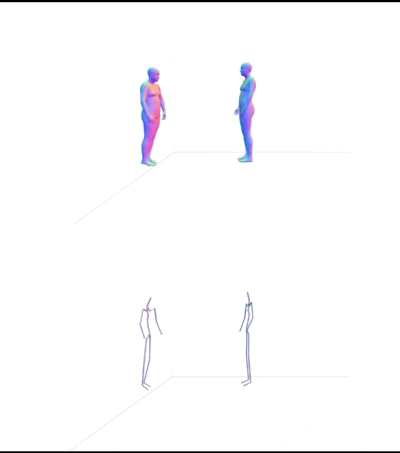

## SDUerHuman: A repository for recording the learning process of embodied intelligence.

<!-- [[Paper Page](https://smpl-x.is.tue.mpg.de)] [[Paper](https://ps.is.tuebingen.mpg.de/uploads_file/attachment/attachment/497/SMPL-X.pdf)]
[[Supp. Mat.](https://ps.is.tuebingen.mpg.de/uploads_file/attachment/attachment/498/SMPL-X-supp.pdf)]-->

 

## Table of Contents

  * [Description](#description)
  * [News](#news)
  * [Installation](#installation)
  * [Guider](#Guider)
  * [Contact](#contact)

## Description

This repository aims to **document and summarize papers and repositories** in the fields of **embodied intelligence, human motion generation**, and related areas. It also provides **practical usage guidance** for the included resources.

- 📂 **Codes**: Contains implementations of common models, including **diffusion-based methods** and others, with usage examples.  
- 📂 **Datasets**: Includes commonly used datasets, preprocessing scripts, and models, along with instructions on how to use them.  
- 📂 **Papers**: Provides **survey summaries, paper reviews, and reproduction notes** to help understand the latest research trends and insights.

> ⚡ This repository is **continuously updated** with new papers, code, and datasets!


## News

- 📖 29 October 2025: **Provided a script that converts 272-dimensional motion representation (MotionStreamer) into SMPL-X parameters and visualizes it, and a script that converts 263-dimensional motion representation (HumanML3D) into global joint coordinates and visualizes it.[here](./Datasets/SMPLX/SMPLX_guide.md)**

- 📝 23 October 2025: **Human Motion Generation Survey (Ongoing 🔄). [here](./Papers/Survey_on_Human_Motion_Generation.md)**

- 📖 22 October 2025: **Provides an introduction to the SMPLX model and instructions for its use; follow the steps in the .ipynb notebook to run the code and visualize the results with Wid3D. [here](./Datasets/SMPLX/SMPLX_guide.md)**

- 🆕 22 October 2025: **The repository was established.**


## Installation

To get started, **clone this repository** and follow the guidance in the **Guider** section.  
According to the instructions for each part, install the required **packages, models, and environments**.

```bash
# Clone the repository
git clone https://github.com/LiuYZ2024/SDUerHuman.git
cd SDUerHuman
```

##  Guider
This section provides links to important resources and surveys included in this repository:

- **SMPLX** ------ [Link to it](./Datasets/SMPLX/SMPLX_guide.md)
- **Human Motion Generation Survey** ------ [Link to it](./Papers/Survey_on_Human_Motion_Generation.md)
- **Motion Representation Comparison** ------ [Link to it](.Datasets/MotionRepresentation.md)


## Contact
lyzle2024@163.com
